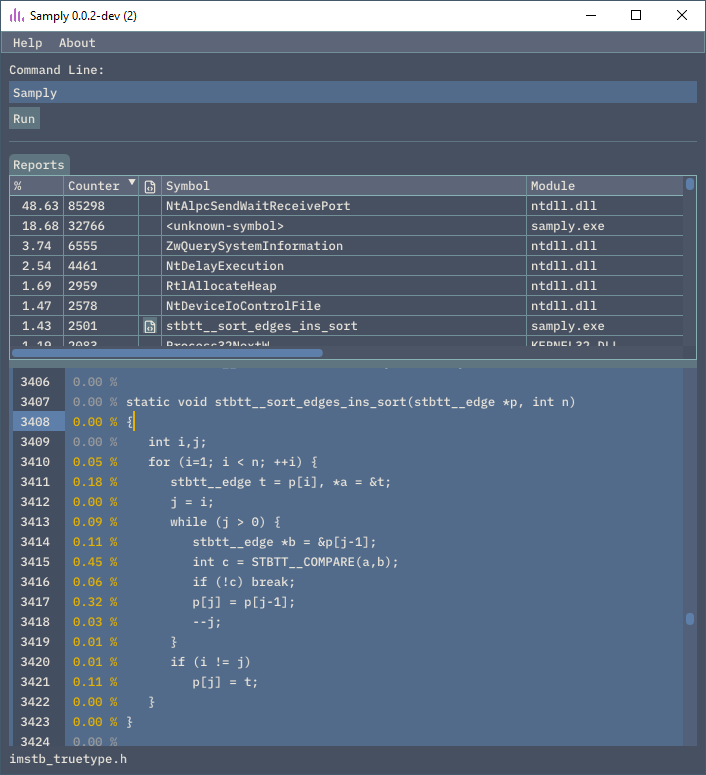

# samply

(Soon) cross-platform and simple sampling (non-intrusive) profiler.

## CLI - Example

`samply --no-gui --run timeout 3`

The command above will run the program `timeout` for `3` seconds.
Meanwhile, the program will be sampled.

Possible output:
```
Sample count: 247989
0.98    242897  NtDelayExecution
0.01    1698    <unknown-symbol>
0.01    1582    NtDeviceIoControlFile
0.00    584     PeekConsoleInputW
0.00    535     ZwClose
0.00    135     RtlGetCurrentUmsThread
0.00    119     NtQueryWnfStateData
0.00    106     RtlFindCharInUnicodeString
```

## GUI - Example

This is a working in progress but here what it will roughly look like.
The function name with number of samples on top right.
And we should be able to open the associated file in the panel at the bottom.



The next step is to display the number/percentage of samples next to each text line.

## TODO

- [./] Display summary in terminal.
- [./] Display summary in GUI.
    - [./] Use a table and make it sortable.
- [./] Create (more or less lightweight) Text Viewer for Dear ImGui.
- Display detailed result in GUI.
    - Display source code associated to the specific symbol.
- Remove .sln file and build with use cb.h
- Implement Linux version once the Windows version is usable.

## Why?

- I wanted to use a sampling profiler on Windows and Linux, but I could not find any that were cross-platform.
This is an attempt to solve my problem.
- While not cross platform, I looked at [Very Sleepy](https://github.com/VerySleepy/verysleepy). Unfortunately, it required an installer.
I tried to compile it to avoid the installer, however there was more than 600 MB of dependency for wxWidget.
Which is why I settled with Dear ImGui as a lightweight alternative.

## Credits and licences

The codebase is MIT and is using those components:

- [imgui](https://github.com/ocornut/imgui) (MIT license)
- samply.ico from [Kirill Kazachek](https://creativemarket.com/kirill.kazachek) (CC BY 4.0 license)
- [thread.h](https://github.com/mattiasgustavsson/libs/blob/main/thread.h) (dual MIT and Public Domain license)
- [text_viewier.hpp] has been created from [ImGuiColorTextEdit](https://github.com/BalazsJako/ImGuiColorTextEdit) (MIT license)